# EDA Report — Depression Detection Dataset

> Comprehensive Exploratory Data Analysis cho Reddit depression classification dataset.
> _Last updated: 2026-05-26 (3-fold split version)_

## Mục lục

1. [Dataset Overview](#1-dataset-overview)
2. [Data Quality & Missing Values](#2-data-quality--missing-values)
3. [Label Distribution](#3-label-distribution)
4. [Subreddit Analysis](#4-subreddit-analysis)
5. [Temporal Analysis](#5-temporal-analysis)
6. [Text Length Distribution](#6-text-length-distribution)
7. [Engagement Metrics (Upvotes & Comments)](#7-engagement-metrics-upvotes--comments)
8. [Text Signals & Lexical Analysis](#8-text-signals--lexical-analysis)
9. [Feature Importance (Mutual Information)](#9-feature-importance-mutual-information)
10. [Sample Posts](#10-sample-posts)
11. [Recommendations for Modeling](#11-recommendations-for-modeling)

---

## 1. Dataset Overview

| Property | Value |
|---|---|
| **Source** | `reddit_depression_dataset.csv` (1.17 GB) |
| **Cached parquet** | `ver2/eda/outputs/cache/raw.parquet` (693 MB) |
| **Total rows** | **2,470,778** |
| **Total columns** | 8 |
| **Date range** | 2008-01-26 → 2022-12-31 (~15 năm) |
| **Task** | Binary classification: label ∈ {0, 1} |

**Columns:**

| Column | Type | Vai trò |
|---|---|---|
| `id` | string | Unique identifier |
| `subreddit` | string | Subreddit name (24 unique) |
| `title` | string | Post title |
| `body` | string | Post body (có thể null hoặc `[removed]`) |
| `upvotes` | int | Upvote count |
| `created_utc` | int | Unix timestamp |
| `num_comments` | int | Comment count |
| `label` | int | Target {0=normal, 1=depression} |

---

## 2. Data Quality & Missing Values

### 2.1 Missing values per column

| Column | Missing | % |
|---|---|---|
| `id` | 4 | 0.0002% |
| `subreddit` | 20 | 0.0008% |
| `title` | 23 | 0.0009% |
| **`body`** | **461,051** | **18.66%** |
| `upvotes` | 63 | 0.0025% |
| `created_utc` | 106 | 0.0043% |
| `num_comments` | 113,977 | 4.61% |
| `label` | 106 | 0.0043% |

**Key issues:**
- `body` missing 18.66% — chủ yếu do `[removed]`/`[deleted]` posts (462,124 rows = 18.7% empty/removed)
- `num_comments` missing 4.61% — cần fill bằng 0 hoặc median
- `id` duplicates: 3 rows (0.0001%) — negligible

### 2.2 Quality issues

| Issue | Count | % |
|---|---|---|
| Body duplicates (≥40 chars, exact match) | 8,526 (in 3,493 groups) | 0.35% |
| Largest duplicate group | 519 copies | — |
| Title == Body | 1,828 | 0.07% |
| URL-only posts | 1 | 0.0% |
| Emoji-heavy posts | 5,626 | 0.23% |
| Extreme long (>20K chars) | 530 | 0.02% |
| Very short non-empty (<10 chars body) | 21,562 | 0.87% |

### 2.3 Language distribution

96.1% English (langdetect, sample n=50K). 3.9% là noise đa ngôn ngữ (af, da, nl, fr...).

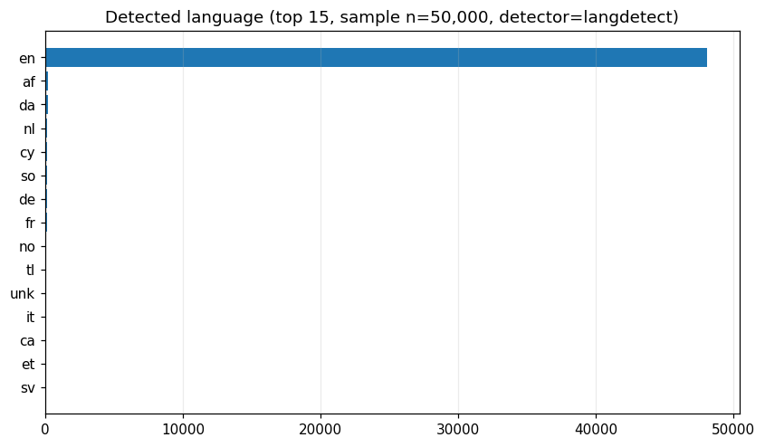

→ **Action:** Có thể filter English-only hoặc giữ nguyên (MentalRoBERTa robust với noise nhỏ).

---

## 3. Label Distribution

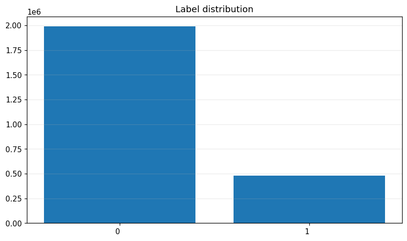

| Class | Count | Percentage |
|---|---|---|
| **0** (normal) | 1,990,261 | **80.56%** |
| **1** (depression) | 480,411 | **19.44%** |

**Imbalance ratio:** 4.14:1 (majority:minority)

→ Cần class weighting hoặc BCE `pos_weight ≈ 4.14` (đã implement trong Stage 1).

---

## 4. Subreddit Analysis

### 4.1 Top subreddits

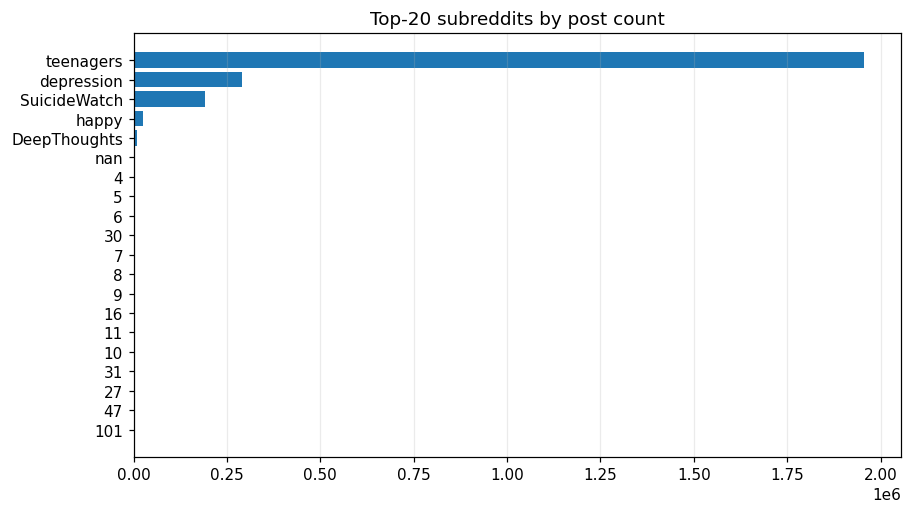

| Subreddit | n | % total | Label rate |
|---|---|---|---|
| **teenagers** | 1,956,489 | 79.2% | **0.0%** |
| **depression** | 290,049 | 11.7% | **100.0%** |
| **SuicideWatch** | 190,362 | 7.7% | **100.0%** |
| **happy** | 24,609 | 1.0% | 0.0% |
| **DeepThoughts** | 9,163 | 0.4% | 0.0% |

Chỉ có **5 subreddit chính** chiếm 99.96% dataset; còn lại 19 subreddit "rác" (gộp lại chỉ 63 rows, <0.01%).

### 4.2 ⚠ Critical insight: Subreddit IS the label

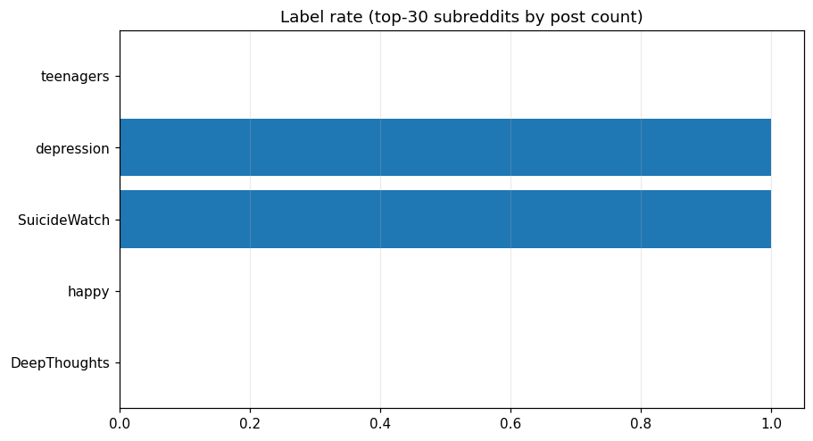

**5 subreddits đều có label rate = 0% HOẶC 100%**:
- `r/depression` + `r/SuicideWatch` → 100% label=1 (gần như **deterministic**)
- `r/teenagers` + `r/happy` + `r/DeepThoughts` → 0% label=1

**Hệ quả:**
- Mutual Information của `subreddit` với label = **0.71 bits** ≈ entropy của label → subreddit gần như **là bản sao của target**, không phải feature
- Model chỉ cần biết subreddit là predict được label gần như 100%
- → **Quyết định (post-EDA): PURGE subreddit + mọi proxy** (`upvotes_pct_in_subreddit`, `year`) khỏi Stage 2. Tiêu chí giữ feature: *tính được từ 1 post đơn lẻ mà không cần biết subreddit*. Subreddit chỉ dùng ở khâu đánh giá (per-subreddit F1 diagnostic + cross-subreddit holdout), không bao giờ là input model.
- Class 1 concentration: **2 subreddit** (depression + SuicideWatch) cover **95%+** positives

### 4.3 Long tail của subreddit

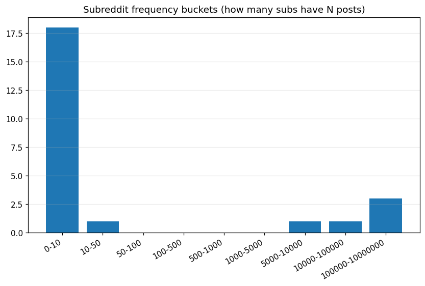

| Bucket | Số subreddit |
|---|---|
| 0-10 rows | 18 |
| 10-50 rows | 1 |
| 50-1k rows | 0 |
| 1k-5k rows | 0 |
| 5k-10k rows | 1 |
| 10k-100k rows | 1 |
| 100k+ rows | 3 |

→ Pattern **bimodal extreme**: 3 sub khổng lồ + 19 sub tí hon. **Quyết định (post-EDA):** subreddit bị **loại hoàn toàn** khỏi feature Stage 2 (xem 4.2 + tech_plan section 6) nên rare-bucketing không còn ý nghĩa — subreddit chỉ derive label rồi drop.

---

## 5. Temporal Analysis

### 5.1 Posts theo năm

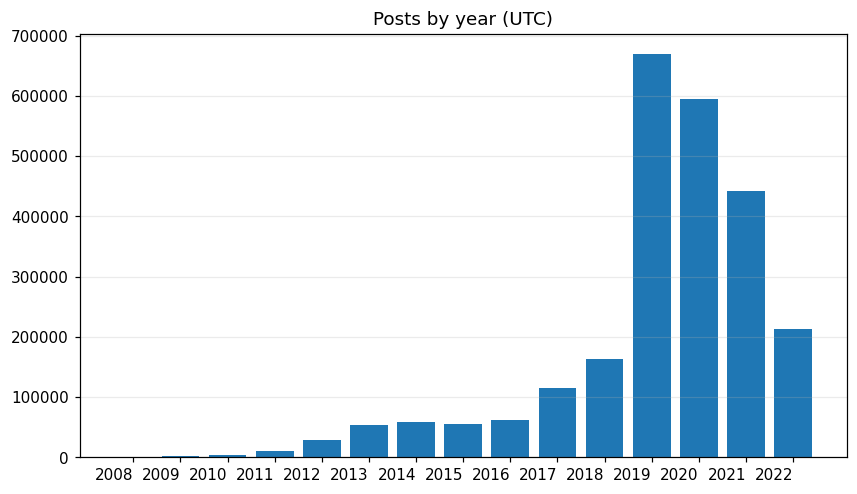

| Năm | Posts | % total |
|---|---|---|
| 2008-2012 | 44,706 | 1.8% |
| 2013-2017 | 345,046 | 14.0% |
| **2018** | 162,351 | 6.6% |
| **2019** | 669,473 | **27.1%** ← peak |
| **2020** | 594,112 | 24.1% |
| **2021** | 442,244 | 17.9% |
| **2022** | 212,740 | 8.6% |

Dataset **lệch mạnh về 2019-2022** (~78%). Năm 2019 chiếm peak có thể do scraping behavior chứ không phải organic growth.

### 5.2 ⚠ Label rate drift theo năm (CRITICAL)

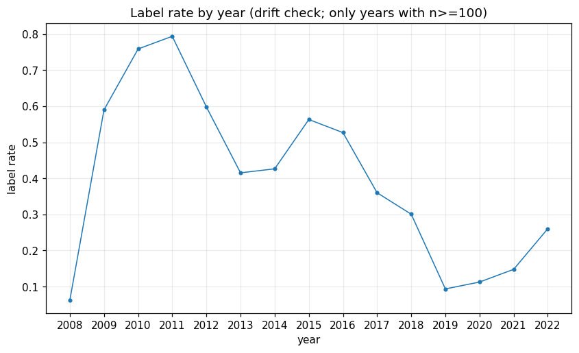

| Năm | Label rate |
|---|---|
| 2008 | 6.2% |
| 2009 | 58.9% |
| 2010 | **79.4%** ← peak |
| 2013 | 41.5% |
| 2018 | 30.1% |
| **2019** | **9.3%** ← lowest |
| 2020 | 11.2% |
| **2021** | **14.8%** |
| **2022** | **26.0%** |

**Label rate drift (max − min) = 0.732** — cực kỳ lớn.

**Diễn dịch:**
- Random split sẽ làm train/val/test có cùng distribution → đánh giá lạc quan giả
- Time-based split (train ≤2020, val 2021, test 2022) mô phỏng đúng tình huống thực: train trên past, predict future
- → **Đã chọn time-based split** trong Stage 1

### 5.3 Posts theo giờ + thứ trong tuần

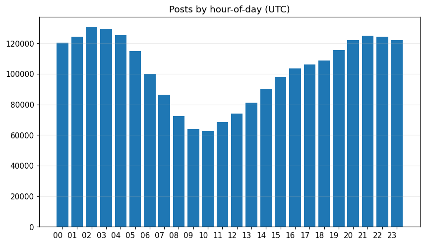
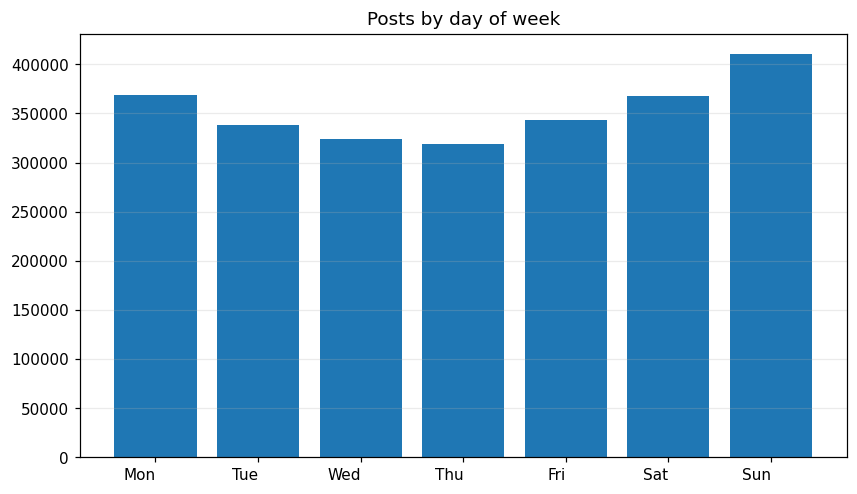

- Peak posting: **0-5 UTC** (= 19-00 US East) — đêm khuya theo giờ Mỹ
- DOW distribution gần đều, Sunday hơi cao hơn

### 5.4 Heatmap: label rate theo (giờ × thứ)

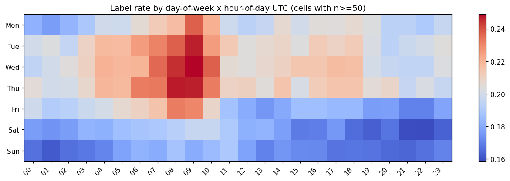

| Variation | Value |
|---|---|
| Min label rate | 0.159 |
| Max label rate | 0.249 |
| Max − Min | **0.090** |

→ Variance ~9% là **moderate signal** cho temporal features. Cyclical encoding (sin/cos) cho hour và DOW đáng include vào LGBM.

**Pattern theo DOW:**
- Mid-week (Tue/Wed/Thu): label rate cao hơn ~21%
- Weekend (Sat/Sun): label rate thấp hơn ~17%
- → Posts mid-week có xu hướng "serious" hơn (depression/suicide-watch active hơn)

---

## 6. Text Length Distribution

### 6.1 Character length

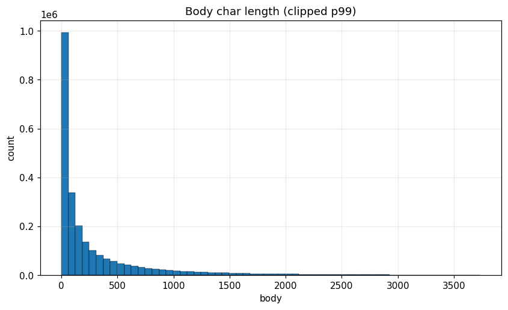
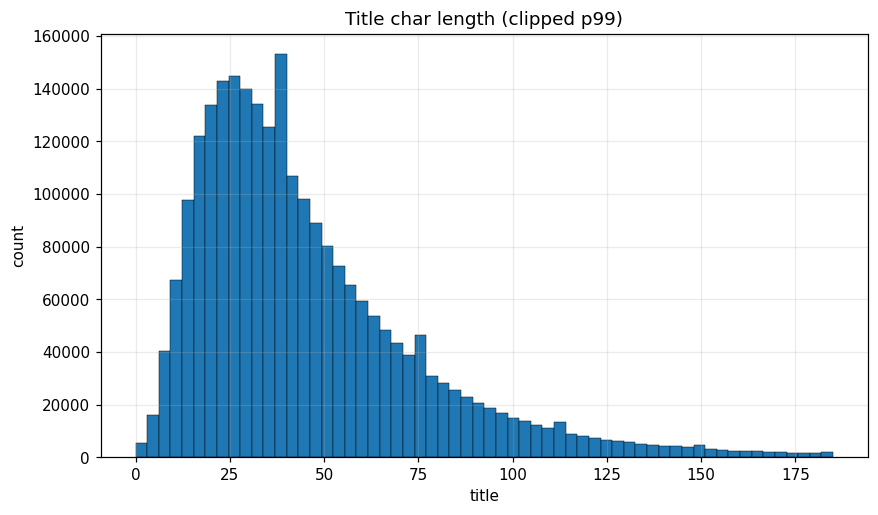

| Stat | Title (chars) | Body (chars) |
|---|---|---|
| Mean | 47.4 | 377.2 |
| Median | 38 | 103 |
| p75 | 59 | 374 |
| p90 | 88 | 977 |
| p95 | 113 | 1,600 |
| p99 | 185 | 3,738 |
| Max | 1,125 | 64,781 |
| Empty count | 23 | 461,051 |

Body distribution **cực kỳ skewed** (skewness = 12.9) — median 103 chars nhưng có post dài 65K chars.

### 6.2 Token length (RoBERTa BPE tokenizer)

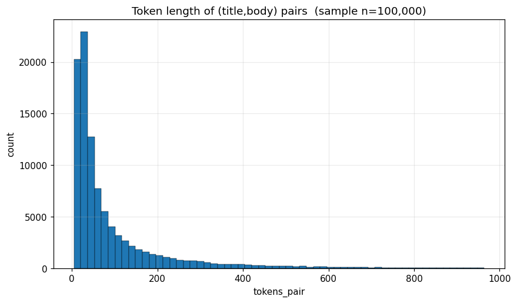

Đo trên sample 100K rows với RoBERTa tokenizer:

| Stat | Title | Body | Pair (Title+Body) |
|---|---|---|---|
| Median | 9 | 27 | 44 |
| p75 | 15 | 94 | 109 |
| p90 | 22 | 242 | 258 |
| p95 | 28 | 396 | 411 |
| p99 | 46 | 946 | **964** |

**Coverage theo max_length:**

| max_length | % rows fit nguyên vẹn |
|---|---|
| 128 | 78.5% |
| 256 | 89.9% |
| 384 | 94.4% |
| **512** | **96.6%** ← chosen |
| 1024 | ~99% |

→ **`max_length = 512`** + head+tail truncation cho 3.4% còn lại = best balance giữa coverage và compute. Đã implement trong Stage 1.

---

## 7. Engagement Metrics (Upvotes & Comments)

### 7.1 Upvotes distribution

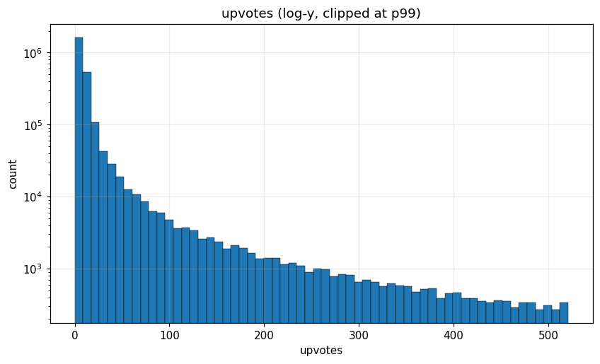

| Stat | Value |
|---|---|
| Mean | 62.6 |
| Median | 7 |
| p95 | 53 |
| p99 | 521 |
| p99.5 | 1,616 |
| Max | 128,866 |
| Skewness | **37.4** (extreme) |
| Negative | 0 |
| Zero | 32 |

### 7.2 Comments distribution

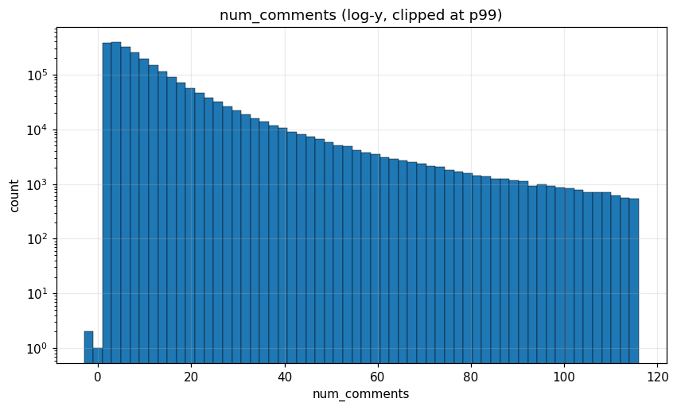

| Stat | Value |
|---|---|
| Mean | 15.3 |
| Median | 7 |
| p99.5 | 195 |
| Max | 21,131 |
| Skewness | **69.8** |

### 7.3 Engagement theo label

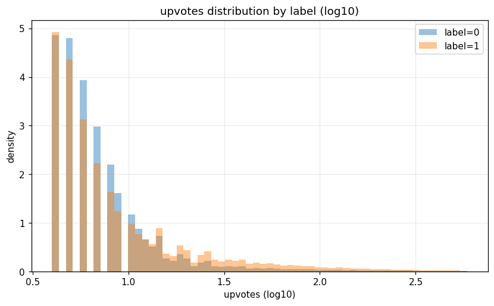

| Metric | Label 0 (normal) | Label 1 (depression) | Diff |
|---|---|---|---|
| upvotes_mean | 71.3 | 26.7 | Label 0 nhiều upvote hơn 2.7× |
| upvotes_median | 7.0 | 7.0 | (median giống nhau) |
| num_comments_mean | 16.7 | 9.0 | Label 0 nhiều comment hơn 1.85× |
| num_comments_median | 8.0 | 4.0 | |
| body_len_mean | 230.9 chars | 983.1 chars | **Label 1 dài hơn 4.26×** |
| body_len_median | 68 | 594 | |
| title_len_mean | 47.7 | 45.8 | gần bằng |

**Insight chính:**
- Posts trong r/depression và r/SuicideWatch **dài hơn nhiều** (median body 594 vs 68 chars)
- Nhưng **engagement thấp hơn** (ít upvote/comment) — có thể vì content khó tương tác
- Title length gần như identical → không phải feature mạnh

### 7.4 Correlation với label

| Feature | Pearson | Spearman |
|---|---|---|
| `body_len` | 0.323 | **0.455** ← strongest |
| `num_comments` | −0.038 | −0.197 |
| `upvotes` | −0.019 | 0.060 |
| `title_len` | −0.021 | −0.031 |

→ **`body_len` là strongest meta feature** (Spearman 0.45). Engagement metrics có tín hiệu yếu.

### 7.5 Outliers

Clip tại **p99.5** để bỏ tail extreme:
- upvotes: cap = 1,616 (12,350 rows bị clip)
- num_comments: cap = 195 (12,295 rows bị clip)

Đã implement trong [01_clean.py](../../preprocess/01_clean.py).

---

## 8. Text Signals & Lexical Analysis

### 8.1 Label rate theo body length bucket

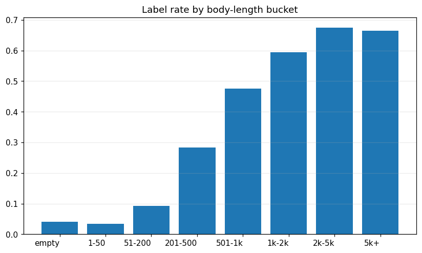

| Bucket | n | Label rate |
|---|---|---|
| empty (no body) | 461,029 | 4.0% |
| 1-50 chars | 436,608 | 3.3% |
| 51-200 | 669,820 | 9.2% |
| 201-500 | 411,253 | **28.4%** |
| 501-1k | 251,900 | **47.5%** |
| 1k-2k | 154,727 | **59.4%** |
| 2k-5k | 72,389 | **67.5%** |
| 5k+ | 12,946 | 66.5% |

**Pattern rất rõ:** Posts càng dài → label=1 (depression) càng nhiều. Body 2k-5k chars có 67.5% là depression. Đây là **signal cực mạnh** cho cả Stage 1 (text model) lẫn Stage 2 (LGBM với `body_length_bucket` feature).

### 8.2 Lexical features lift (label=1 vs label=0)

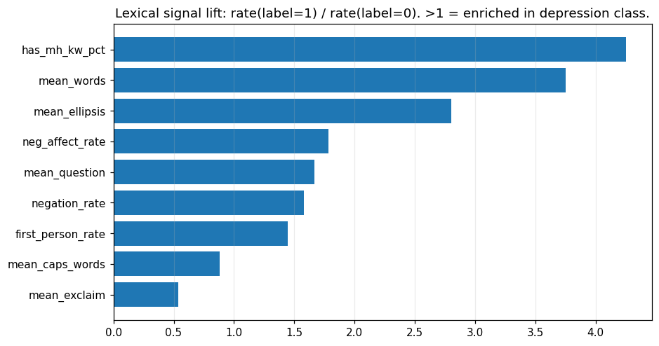

| Feature | Label 0 | Label 1 | Lift (1/0) |
|---|---|---|---|
| **MH keyword presence** | 19.9% | **84.8%** | **4.26×** |
| **mean_words** | 52.9 | 198.4 | 3.75× |
| **mean_ellipsis (...)** | 0.145 | 0.406 | 2.80× |
| **mean_neg_affect_rate** | 0.6% | 1.1% | 1.78× |
| **mean_question (?)** | 0.51 | 0.85 | 1.67× |
| **mean_negation_rate** (no/not/never) | 1.05% | 1.66% | 1.58× |
| **first_person_rate** (I/me/my) | 7.4% | 10.7% | 1.44× |
| mean_caps_words | 0.82 | 0.72 | 0.88× |
| mean_exclaim (!) | 0.33 | 0.18 | **0.54×** ← Label 0 dùng nhiều hơn |

**Interpretation:**
- **MH keyword (depression, anxious, suicide...) 4.3× lift** → có thể flag từ rule-based gần như chính xác. Nhưng RoBERTa sẽ học pattern phức tạp hơn
- **First-person pronoun 1.44× lift** → matches clinical depression literature ("self-focus marker")
- **Ellipsis "..." 2.8× lift** → suy nghĩ rời rạc, hesitation
- **Exclamation marks 0.54×** (lower in label 1) → ít hứng khởi (matches anhedonia)
- **Word count 3.75× lift** → depressed posts dài hơn nhiều (rumination)

### 8.3 Distinctive unigrams cho label=1

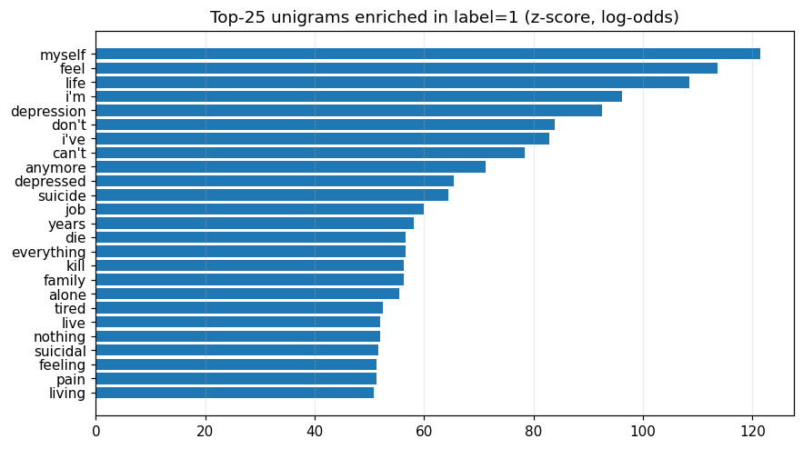

**Top 20 từ "đặc trưng" của label=1** (z-score):

| Term | z | n_label1 | n_label0 |
|---|---|---|---|
| myself | 121.5 | 32,258 | 8,247 |
| feel | 113.6 | 41,707 | 16,970 |
| life | 108.5 | 35,688 | 13,725 |
| i'm | 96.3 | 62,065 | 37,982 |
| depression | 92.6 | 15,770 | 1,964 |
| don't | 83.9 | 37,921 | 21,060 |
| i've | 82.8 | 23,009 | 9,596 |
| can't | 78.4 | 18,469 | 7,012 |
| anymore | 71.2 | 11,656 | 3,219 |
| depressed | 65.4 | 8,698 | 1,870 |
| suicide | 64.4 | 7,724 | 1,123 |
| die | 56.7 | 8,563 | 2,869 |
| kill | 56.3 | 7,296 | 2,007 |
| alone | 55.4 | 7,941 | 2,568 |
| tired | 52.4 | 6,574 | 1,920 |
| anymore | 71.2 | 11,656 | 3,219 |

**Top distinctive cho label=0** (teenagers/happy/DeepThoughts):

| Term | z |
|---|---|
| guys | 81.3 |
| girl | 66.6 |
| school | 56.8 |
| crush | 51.7 |
| reddit | 49.0 |
| class | 46.4 |
| teacher | 42.2 |

→ Label 0 chủ yếu là posts của teenagers nói về school/relationships/social. Khác hoàn toàn về domain với label 1.

### 8.4 Top distinctive bigrams cho label=1

| Bigram | z | n_label1 | n_label0 |
|---|---|---|---|
| **kill myself** | 51.4 | 5,228 | 400 |
| i'm tired | 34.8 | 2,344 | 355 |
| don't what | 32.2 | 3,558 | 1,427 |
| feel i'm | 29.9 | 1,930 | 436 |
| don't feel | 29.5 | 2,087 | 570 |
| **hate myself** | 29.5 | 1,785 | 352 |
| fuck life | 28.7 | 1,645 | 118 |
| **suicidal thoughts** | 28.3 | 1,524 | 176 |
| **killing myself** | 26.9 | 1,456 | 102 |
| every day | 24.1 | 2,658 | 1,293 |
| i've tried | 24.0 | 1,100 | 156 |
| depression anxiety | 22.9 | 1,016 | 155 |
| mental health | 20.2 | 1,529 | 656 |

→ Pattern bigrams ngắn gọn nhưng cực kỳ predictive. Một số như "kill myself" có ratio gần 13:1 — model dễ học signal này.

---

## 9. Feature Importance (Mutual Information)

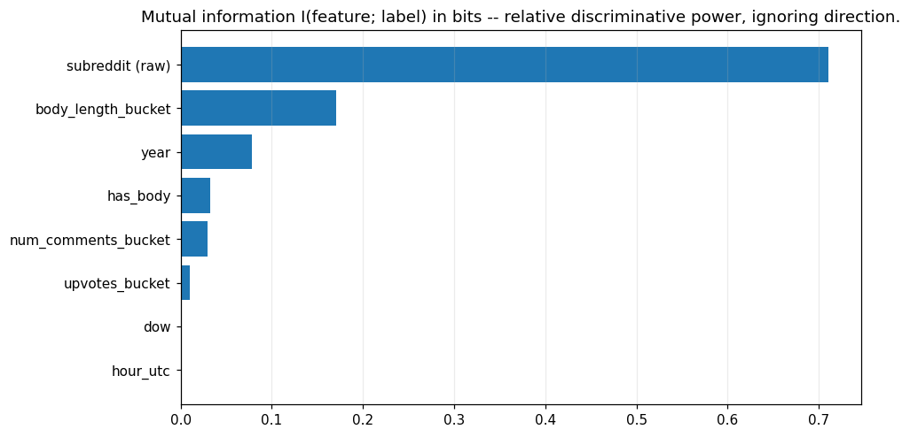

| Feature | MI (bits) |
|---|---|
| **`subreddit` (raw)** | **0.711** ← dominant |
| `body_length_bucket` | 0.170 |
| `year` | 0.078 |
| `has_body` | 0.033 |
| `num_comments_bucket` | 0.030 |
| `upvotes_bucket` | 0.010 |
| `dow` | 0.001 |
| `hour_utc` | 0.0005 |

**Insight quan trọng:**
- `subreddit` chiếm **4.2× MI** của feature thứ 2, và MI=0.71 ≈ H(label) → đây là **bản sao của target**, không phải feature
- Nếu cho LGBM dùng `subreddit` → model chỉ học `subreddit → label` (F1≈1.0 trivial), các feature khác bị bỏ qua
- `year` (MI=0.078) cũng là **proxy của subreddit** (thành phần subreddit đổi theo năm) + vỡ dưới time-split → loại luôn
- → **Quyết định: PURGE subreddit + year + upvotes_pct_in_subreddit.** Stage 2 dùng **một feature set subreddit-blind duy nhất** (không train "version có subreddit")

**Stage 2 LGBM variants (đều subreddit-blind):**
1. **Full ensemble**: `p_text` + meta (text-derived + engagement + temporal) — **kết quả chính**
2. Metadata-only (no `p_text`) — baseline đo đóng góp của text
3. Chỉ `p_text` (Stage 1 output) — pure text contribution
4. **Cross-subreddit holdout** (train trên 3 sub → test 2 sub khác) — đo content-understanding thực sự

---

## 10. Sample Posts

### 10.1 Random label=1 example (typical depression post)

```
Subreddit: r/depression | Label: 1 | Upvotes: 5
Title: Lucked out unbelievably into finding an excellent counsellor yesterday

Body: I spoke with a counsellor I've never had before and - oh man - a counsellor
that suits me made all the difference to a therapy session! Normally I feel so
horrendous after counselling that it basically takes out any hope of productivity
for days, but yesterday I felt *okay*-ish after the session...
[592 chars total]
```

### 10.2 Random label=1 example (suicidal ideation)

```
Subreddit: r/SuicideWatch | Label: 1 | Upvotes: 6
Title: I Love You All.

Body: I mean it. Love to every one of you. I'm sick and tired of this, though.
I'm tired of playing games... The only thing that matters to me at this point is
death... Sorry guys, but this one was unsuccessful. I wish the best to all of you.
[480 chars total]
```

→ Hai posts cùng label=1 nhưng **rất khác về nội dung**: 1 post positive về therapy, 1 post suicidal note. Model cần generalize được cả 2.

### 10.3 Sample files đầy đủ

Xem chi tiết 25 posts mỗi loại trong:
- [`samples/random_label0.md`](samples/random_label0.md) — random class 0
- [`samples/random_label1.md`](samples/random_label1.md) — random class 1
- [`samples/long_label1.md`](samples/long_label1.md) — long posts class 1
- [`samples/short_label1.md`](samples/short_label1.md) — short posts class 1
- [`samples/no_mh_keywords_label1.md`](samples/no_mh_keywords_label1.md) — class 1 không có MH keyword (hard cases)
- [`samples/with_mh_keywords_label0.md`](samples/with_mh_keywords_label0.md) — class 0 có MH keyword (false positives candidates)

---

## 11. Recommendations for Modeling

### 11.1 Data Cleaning (đã làm trong [01_clean.py](../../preprocess/01_clean.py))

- [x] Drop rows null `label`/`id` (110 rows)
- [x] Dedup body (≥40 chars, normalized): 606 rows removed
- [x] Mark `body_marked_removed = True` cho `[removed]`/`[deleted]` (462,102 rows)
- [x] Clip upvotes/comments tại p99.5
- [x] Sentinel tokens: `[URL]`, `[USER]`, `[SUB]`
- [ ] Optional: filter non-English (3.9%) — chưa làm

### 11.2 Splitting Strategy (đã làm trong [02_split.py](../../preprocess/02_split.py))

- [x] **Time-based PRIMARY split**: train ≤2020, val=2021, test=2022 (justify bởi drift 0.73)
- [x] **3-fold OOF** trên time_train (stratified by label)
- [x] Random stratified split (secondary, để so sánh)

### 11.3 Stage 1 (MentalRoBERTa fine-tuning)

| Setting | Value | Lý do |
|---|---|---|
| Backbone | MentalRoBERTa | Domain-pretrained, head-start |
| `max_length` | 512 | 96.6% coverage |
| Truncation | Head+tail | Giữ context đầu + cuối khi quá dài |
| LoRA | r=16, q+v | Train chỉ 0.47% params |
| Custom head | Layer-avg(4) + Dual-pool + ResFFN + MSD(5) | Per tech_plan 5.3 |
| Loss | BCE + pos_weight + label_smoothing 0.05 | Counter class imbalance |
| Undersample neg | 0.5 per-fold | Speed up training (1.7×), keep all positives |

### 11.4 Stage 2 (LightGBM)

| Setting | Value | Lý do |
|---|---|---|
| **Subreddit feature** | **PURGE hoàn toàn** (+ proxy: `year`, `upvotes_pct_in_subreddit`) | MI=0.71 ≈ H(label) → là bản sao target, không phải feature |
| Cyclical features | sin/cos cho hour, DOW | Khớp với pattern temporal (MI thấp nhưng rẻ) |
| `class_weight` | 'balanced' | Imbalance ratio 4.14:1 |
| Categorical còn lại | `has_title`, `has_body` (boolean) | Post-level, không phải subreddit |
| Eval per-subreddit | join `eval_subreddit.parquet` | Diagnostic ONLY — không nạp vào model |

### 11.5 Evaluation Metrics

Primary metrics (báo cáo cả 2):
- **F1_macro** — main scoring metric
- **PR-AUC** — robust với imbalance, không phụ thuộc threshold

Secondary:
- F1_pos (chỉ class minority)
- Recall_pos (false-negative bad cho depression detection)
- ROC-AUC
- Accuracy (ít informative do imbalance)

### 11.6 Reporting structure

Báo cáo **2 metric numbers**:
1. **Random split metric** (over-optimistic, để so sánh với baseline literature)
2. **Time-based split metric** (honest, là production estimate)

Spread giữa 2 metric này cho thấy mức độ time-drift của model.

---

## Phụ lục: Toàn bộ charts trong [`plots/`](plots/)

Charts có trong báo cáo (15):
- `label_distribution.png`
- `top20_subreddits.png`
- `label_rate_top30_subreddits.png`
- `subreddit_long_tail.png`
- `language_distribution.png`
- `posts_by_year.png`
- `label_rate_by_year.png`
- `posts_by_hour_utc.png`
- `posts_by_dow.png`
- `heatmap_label_rate_dow_x_hour.png`
- `hist_body_chars.png`
- `hist_title_chars.png`
- `hist_token_lens_pair.png`
- `hist_upvotes_log.png`
- `hist_num_comments_log.png`
- `kde_upvotes_by_label.png`
- `label_rate_by_body_length_bucket.png`
- `lexical_lift_label1_over_label0.png`
- `distinctive_terms_label1_top25.png`
- `mutual_info_with_label.png`

Charts khác (xem trực tiếp trong [`plots/`](plots/)):
- `box_body_len_by_label.png`, `box_upvotes_by_label.png`
- `hist_body_chars.png`, `hist_token_lens_body.png`, `hist_token_lens_title.png`
- `hist_upvotes.png`, `hist_num_comments.png`
- `kde_comments_per_upvote_by_label.png`, `kde_num_comments_by_label.png`
- `label_rate_by_dow.png`, `label_rate_by_hour_utc.png`
- `heatmap_subreddit_x_year_label_rate.png`
- `lexical_lift_label1_over_label0.png`
- `posts_by_year_month.png`
- `scatter_engagement.png`, `scatter_subreddit_n_vs_label_rate.png`

---

_Báo cáo này là tổng hợp từ EDA scripts trong [`ver2/eda/`](../). Source data: [`cache/raw.parquet`](cache/raw.parquet) (693 MB), stats chi tiết: [`cache/stats.json`](cache/stats.json). Issues riêng: [`data_issues.md`](data_issues.md)._
