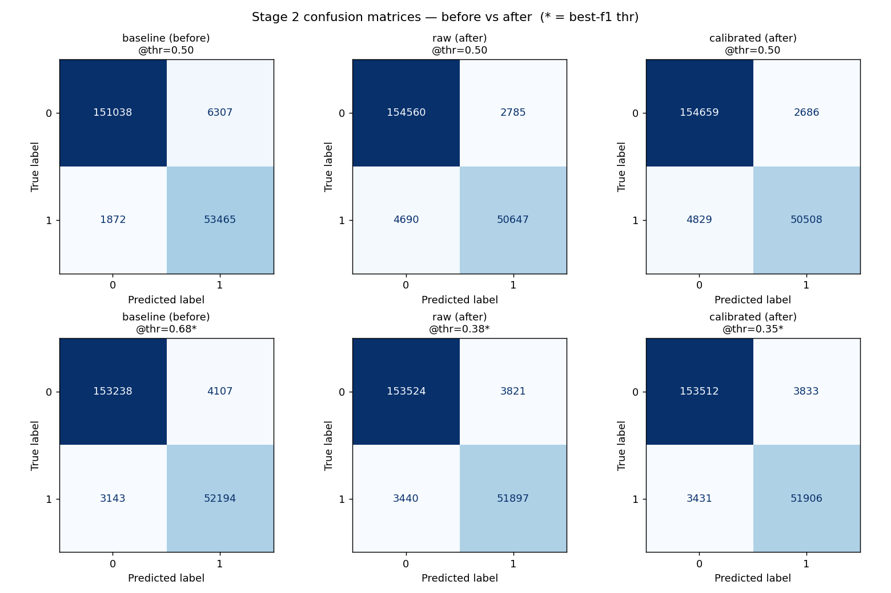
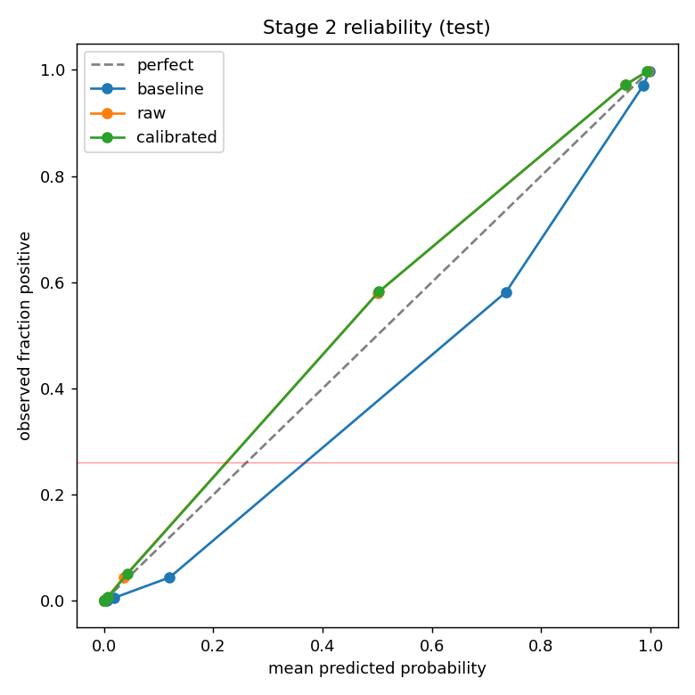

# Stage 2 — Before/After Comparison

TEST split: **212,682** rows · base rate (actual positive) = **0.2602**

- **before** = `stage2_lgbm.pkl` (class_weight=balanced, f1-tuned)
- **after**  = `stage2_lgbm_raw.pkl` (no class_weight) and `stage2_lgbm_calibrated.pkl` (+ isotonic, canonical)

## 1. Probability quality (what we optimized)

Lower log loss / Brier / ECE = better. `mean_p` should sit near the base rate; the baseline over-predicts.

| model | log_loss | brier | ECE | roc_auc | mean_p |
| --- | --- | --- | --- | --- | --- |
| baseline (before) | 0.1021 | 0.0292 | 0.0266 | 0.9933 | 0.2868 |
| raw (after) | 0.0924 | 0.0264 | 0.0108 | 0.9932 | 0.2494 |
| calibrated (after) | 0.0926 | 0.0265 | 0.0107 | 0.9932 | 0.2495 |

## 2. Thresholded labels @ 0.50

| model | accuracy | precision | recall | f1_pos | f1_macro |
| --- | --- | --- | --- | --- | --- |
| baseline (before) | 0.9615 | 0.8945 | 0.9662 | 0.9289 | 0.9513 |
| raw (after) | 0.9649 | 0.9479 | 0.9152 | 0.9313 | 0.9538 |
| calibrated (after) | 0.9647 | 0.9495 | 0.9127 | 0.9308 | 0.9535 |

> Note: after dropping class_weight the probability scale shrank, so recall @0.5 drops — that is expected, not a regression. See §3 for a fair like-for-like at each model's best threshold.

## 3. Thresholded labels @ best-f1-macro threshold

| model | thr* | accuracy | precision | recall | f1_pos | f1_macro |
| --- | --- | --- | --- | --- | --- | --- |
| baseline (before) | 0.68 | 0.9659 | 0.9271 | 0.9432 | 0.9351 | 0.9560 |
| raw (after) | 0.38 | 0.9659 | 0.9314 | 0.9378 | 0.9346 | 0.9558 |
| calibrated (after) | 0.35 | 0.9658 | 0.9312 | 0.9380 | 0.9346 | 0.9557 |

## 4. Confusion matrices

**baseline (before)** @thr=0.50

| actual \ pred | neg (0) | pos (1) |
| --- | --- | --- |
| neg (0) | 151038 | 6307 |
| pos (1) | 1872 | 53465 |

**baseline (before)** @thr=0.68

| actual \ pred | neg (0) | pos (1) |
| --- | --- | --- |
| neg (0) | 153238 | 4107 |
| pos (1) | 3143 | 52194 |

**raw (after)** @thr=0.50

| actual \ pred | neg (0) | pos (1) |
| --- | --- | --- |
| neg (0) | 154560 | 2785 |
| pos (1) | 4690 | 50647 |

**raw (after)** @thr=0.38

| actual \ pred | neg (0) | pos (1) |
| --- | --- | --- |
| neg (0) | 153524 | 3821 |
| pos (1) | 3440 | 51897 |

**calibrated (after)** @thr=0.50

| actual \ pred | neg (0) | pos (1) |
| --- | --- | --- |
| neg (0) | 154659 | 2686 |
| pos (1) | 4829 | 50508 |

**calibrated (after)** @thr=0.35

| actual \ pred | neg (0) | pos (1) |
| --- | --- | --- |
| neg (0) | 153512 | 3833 |
| pos (1) | 3431 | 51906 |

## 5. Reliability (calibration) curve

